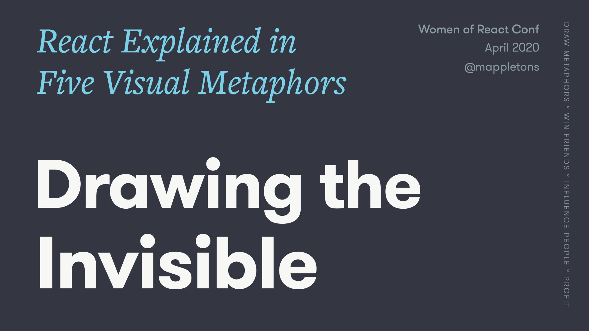
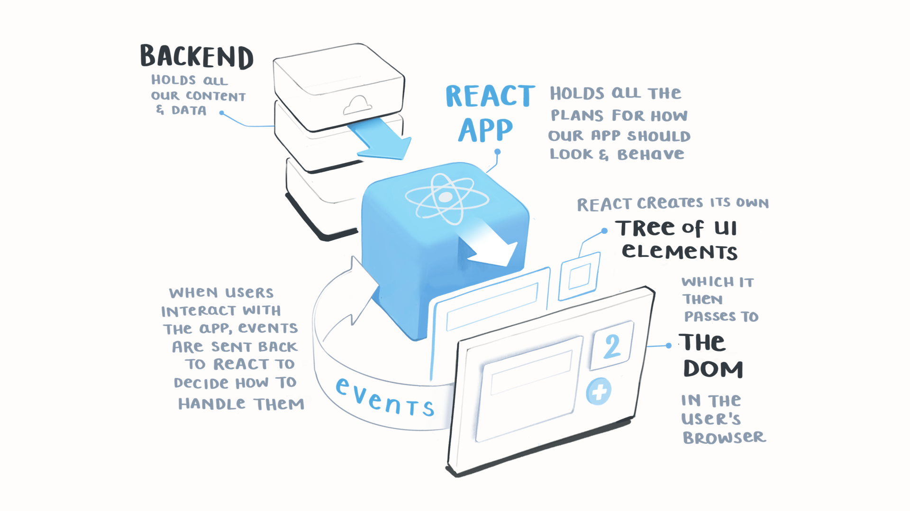
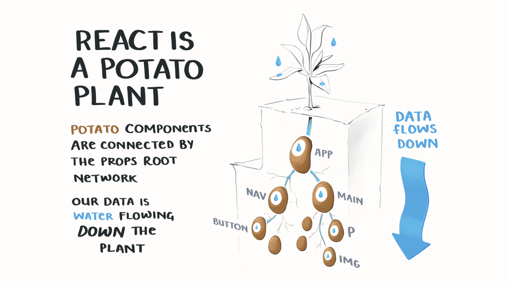

# Drawing the Invisible: React Explained in Five Visual Metaphors
Slides from my talk "Drawing the Invisible: How to Explain React in Visual Metaphors" at Women of React Conf 2020

---

Licensed under CC Attribution-ShareAlike 4.0

Sharing with attirubtion to back to me is 👌
